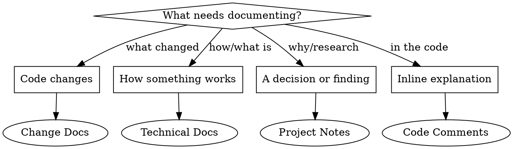

# Documentation

Write the right kind of doc, in the right place, in the right format.

## Routing



## Change Docs

For documenting what changed and why — changelogs, release notes, PR descriptions.

| Type | Where | Format |
|------|-------|--------|
| Changelog entry | `CHANGELOG.md` or project convention | Keep, Added, Changed, Fixed, Removed |
| Release notes | GitHub release / Redmine version | User-facing language, group by impact |
| PR description | PR body | Summary bullets + test plan |
| Commit summary | Asked to explain recent commits | Group by area, link to commits |

**Changelog pattern:**
```markdown
## [version] - YYYY-MM-DD

### Added
- Feature description with context on why (#issue)

### Fixed
- Bug description — what was wrong and what changed (#issue)

### Changed
- What moved/renamed/refactored and why
```

**When writing change docs:**
1. Read the actual diff (`git diff`, `git log`) — never guess what changed
2. Lead with impact, not implementation details
3. Group related changes together
4. Reference issue/ticket numbers when available

## Technical Docs

For explaining how things work — READMEs, API docs, architecture docs.

| Type | Where | When to update |
|------|-------|----------------|
| README | Project root `README.md` | New setup steps, changed commands, new features |
| API docs | Near the code or `docs/` | New/changed endpoints, params, responses |
| Architecture | `docs/` or `_research/` | Structural changes, new components, new patterns |
| Config reference | README or dedicated file | New env vars, new settings, changed defaults |

**README update pattern:**
1. Read existing README first
2. Only update sections affected by the change
3. Keep the existing structure and voice
4. Update command examples if they changed
5. Add new sections at the logical position, not appended at the end

**API doc pattern:**
```markdown
### `METHOD /path`

Description of what it does.

**Parameters:**
| Name | Type | Required | Description |
|------|------|----------|-------------|

**Response:** `200 OK`
Description or example body.

**Errors:**
| Status | When |
|--------|------|
```

## Project Notes

For research, decisions, and planning — lives in `_research/` (gitignored).

| Type | Filename pattern | Purpose |
|------|-----------------|---------|
| Decision record | `adr-NNN-title.md` | Why we chose X over Y |
| Research notes | `topic-name.md` | Findings, links, options explored |
| Planning doc | `plan-feature-name.md` | Implementation approach before coding |
| Investigation | `debug-issue-name.md` | Root cause analysis, reproduction steps |

**Decision record pattern:**
```markdown
# ADR-NNN: Title

## Status
Accepted | Proposed | Superseded by ADR-NNN

## Context
What prompted this decision.

## Options Considered
1. **Option A** — pros / cons
2. **Option B** — pros / cons

## Decision
What we chose and why.

## Consequences
What changes as a result.
```

## Code Comments

Only add comments where the logic is not self-evident. Do not add comments to code you did not change.

**Do comment:**
- Non-obvious "why" (workarounds, business rules, constraints)
- Regex patterns — always explain what they match
- Magic numbers — what they represent
- External dependencies — why this specific version/approach

**Do not comment:**
- What the code literally does (the code says that)
- Function signatures that are self-descriptive
- Boilerplate JSDoc on every function

## Format Rules

| Destination | Format |
|-------------|--------|
| Redmine (issues, wiki) | **Textile** per project conventions |
| GitHub (PRs, issues, releases) | GitHub-flavored Markdown |
| Project files | Markdown |
| `_research/` notes | Markdown |

## Checklist

Before finishing any documentation task:
- [ ] Read the existing doc/section before modifying (preserve voice and structure)
- [ ] Verified facts against actual code or diffs (no hallucinated details)
- [ ] Placed the doc in the right location per the routing table
- [ ] Used the correct format (Textile for Redmine, Markdown otherwise)
- [ ] No self-attribution or promotional text
- [ ] Linked to related issues/tickets where applicable
